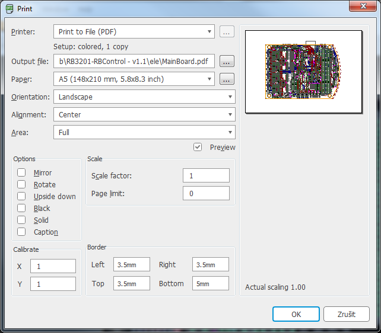
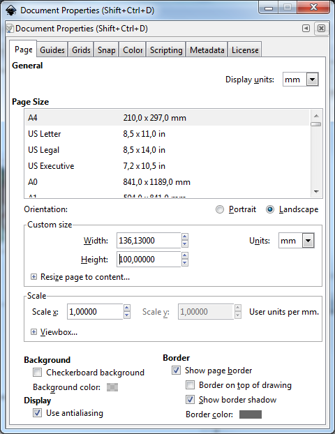
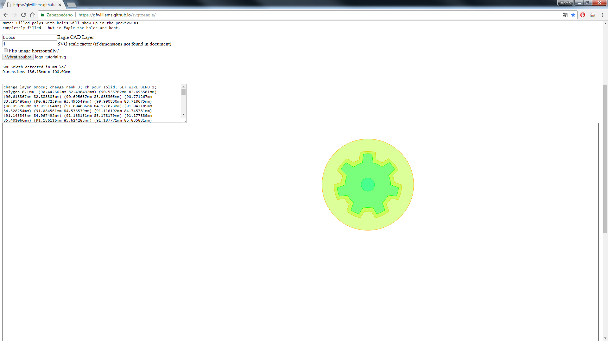
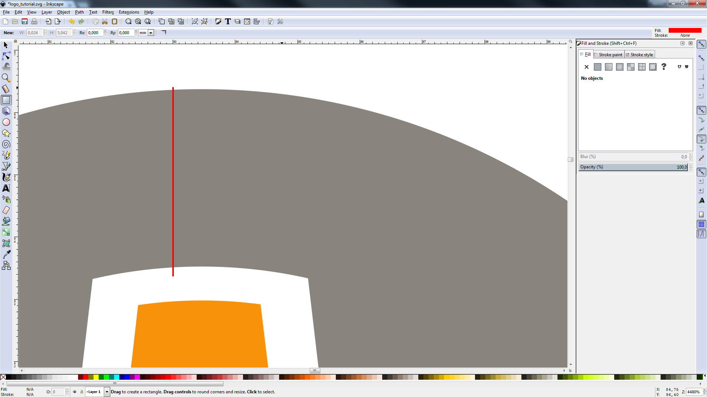
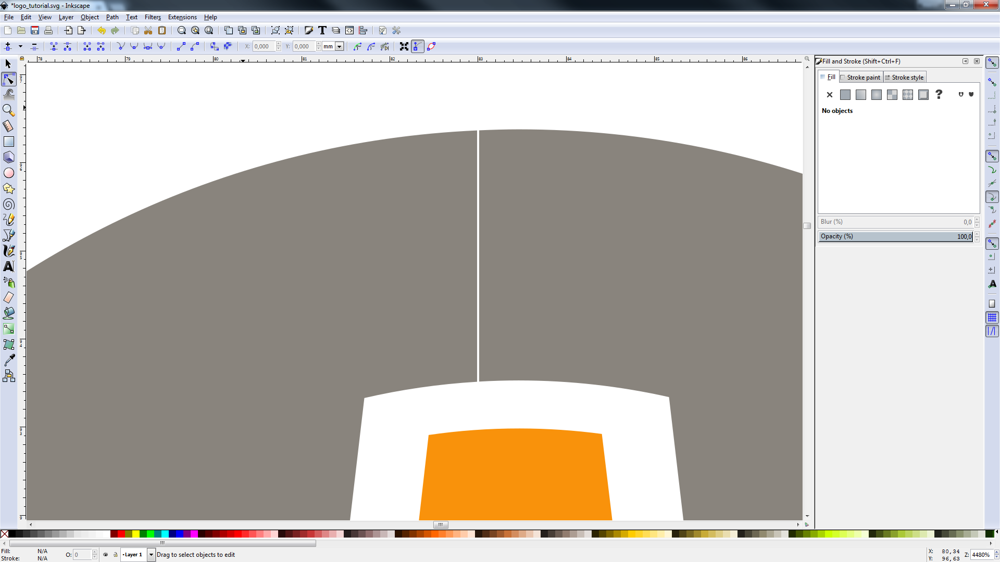
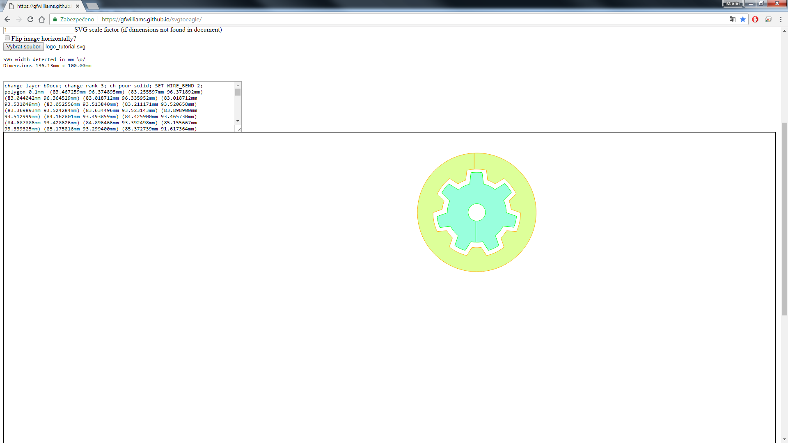
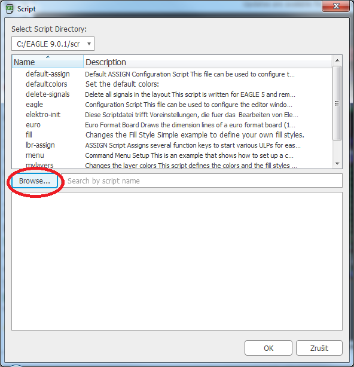

# Jak importovat loga do desky v Eagle

## Instalace software
Je tøeba stáhnout a nainstalovat program [Inkscape](https://inkscape.org/cs/),

Dále samozøejmì program [Eagle](https://www.autodesk.com/products/eagle/overview) - návod dìlán ve verzi 9.0.1

## Pøíprava dat
Loga, která chceme importovat je tøeba mít pøevedeny do formátu SVG
Dále doporuèuji, ale není to nutné, vyexportovat si náhled desky. Bude se nám potom lépe umis�ovat logo, napø. nám potom nehrozí umístìní loga na souèástku apod.

### Export desky z Eagle a import do Inkscape
Pro export dáme `File` -> `Print (Ctrl+P)` a otevøe se nám okno, kde musíme nastavit následující parametry:

Poté importujeme vzniklé PDF do Inkscape, kde jsme si vytvoøili nový dokument, `File` -> `Import Ctrl+I` a vybereme soubor PDF, odklikáme všechny dialogy a poèkáme než se vloží

Výsledek by mìl vypadat nìjak takto:

## Úprava dokumentu a import loga

Abychom mohli nastavit správnou velikost dokumentu, musíme zjistit rozmìry desky. To provedeme tak, že si otevøeme desku v Eagle a vpravo klikneme na `MANAFACTURING` -> `Board` a rozklikneme roletku `Board`. Zde nás zajímají parametry Width (šíøka) a Height (výška).

Potøebujeme upravit velikost dokumentu, abychom mìli vzor desky a loga 1:1. Otevøeme vlastnosti dokumentu `File` -> `Document Properties (Shift+Ctrl+D)`. Zde zhruba uprostøed najdeme nastavení `Custom size`, zde nastavíme hodnoty, které jsme získali v pøedchozím kroce:

Jakmile máme nastavenou stejnou velikost dokumentu, jaká je velikost naší desky, tak musíme desku posunout tak, aby její okraje splývaly s okraji dokumentu. To provedeme tak, že vybereme desku a nastavíme její pozici v souøadnicovém systému na `X = 0  Y = 0`:

Nyní máme správnì nastaven dokument, importovanou desku jako pøedlohu a mùžeme pøistoupit k vložení samotných log.

Logo vložíme kliknutím na `File` -> `Import (Ctrl+I)` a vybereme SVG soubor s logem. Jakmile máme vloženo, je tøeba nastavit vhodnou velikost loga a jeho umístìní.

Jakmile máme logo vhodnì umístìné je potøeba odstranit desku, kterou jsme použili jako šablonu.

## Pøevod loga do scriptu pro Eagle

Logo budeme vkládat jako script do Eaglu, který nám vytvoøí body a následnì polygony, které budou tvoøit výsledné obrazce. Pro generování scriptu použijeme [tuhle](https://gfwilliams.github.io/svgtoeagle/) stránku:

Zde je potøeba vyplnit pole `Eagle CAD Layer`, do tohoto pole zadejte název vrstvy v Eagle, do které chcete výsledná loga vložit, já použiji `bDocu`

Dále je tøeba nastavit `SVG scale factor` na hodnotu `1`, ale je možné použít i jiné hodnoty, záleží na tom, jaké jste si nastavili mìøítko dokumentu v Inkscape, já mìl 1:1 tudíž volím 1

Je možné zde výsledný obrazec horizontálnì otoèit, ale nedoporuèuji to, mnohem lepší je loga otoèit ještì v Inkscapu. Potøeba otáèet loga je, když chceme loga vkládat na spodní stranu desky.

No a nakonec vybereme soubor SVG, ve kterém máme náš dokument, který má nastaveny správné rozmìry a obsahuje pouze logo.

Takhle nìjak mùže vypadat výsledek:

Vidíme ale, že je barevnì vyplnìna i pùvodnì bílá plocha uprostøed loga, kterou by Eagle bral jako souèást loga a tudíž by z celého loga byl vidìt jen kruh.

Musíme tedy opravit uzavøené obrysy, které mají obsahovat nìjakou "díru". Tohoto lze nejjednodušeji dosáhnout tak, že si v Inkscapu vytvoøíme miniaturní obdélník, který nám vytvoøí "prùtok" do díry v uzavøeném obrysu:

Jakmile máme vytvoøeno, zvolíme nástroj `Edit paths by nodes (F2)` a vybereme obrys, do kterého má být udìlána díra a námi vytvoøený obdélník (v tomto pøípadì èervený) a zvolíme nástroj `Path` -> `Difference (Ctrl+-)`, tento postup samozøejmì opakujeme pro všechny uzavøené obrysy obsahující díru, které se zde vyskytují:

Nyní máme v obrysu vytvoøen malý "prùtok" díky kterému už se nám vytvoøí korektní data pro Eagle:

Zkontrolujeme na náhledu, že se nám všechny loga korektnì pøevedly. Jestli je všechno v poøádku, tak zkopírujeme vygenerovaný text v poli nad náhledem napø. do poznámkového bloku (já použiju [PSPad](http://www.pspad.com/cz/)) a uložte jej jako soubor s koncovkou `.scr`.

Nyní výsledný soubor importujeme do Eagle `File` -> `Execute Script...`, otevøe se nám následující okno:

Zde vybereme náš soubor `.scr` a potvrdíme výbìr. Nyní již máme naše logo v Eaglu ve vrstvì è.52 s názvem bDocu jako polygon a není problém jej pøi výrobì natisknout na desku jako popisek.

