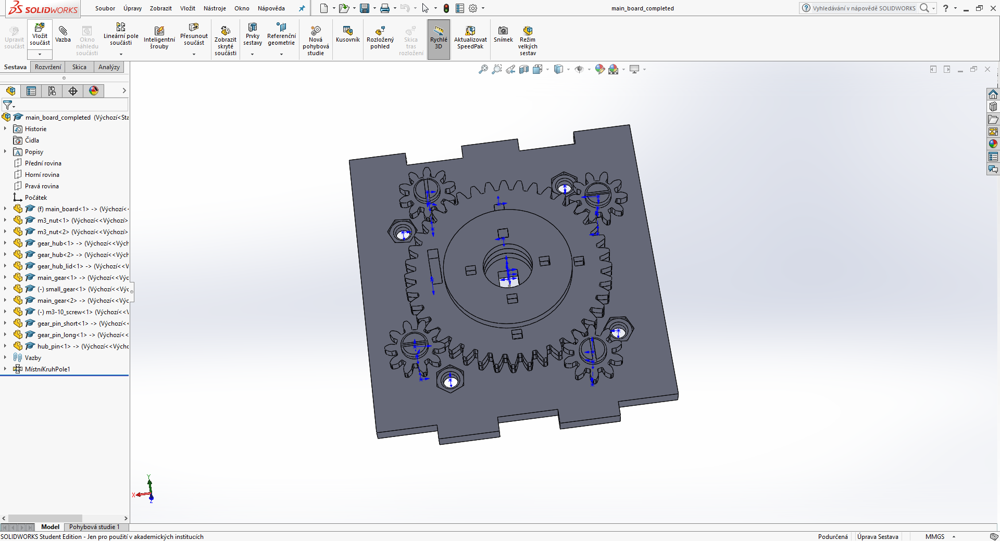
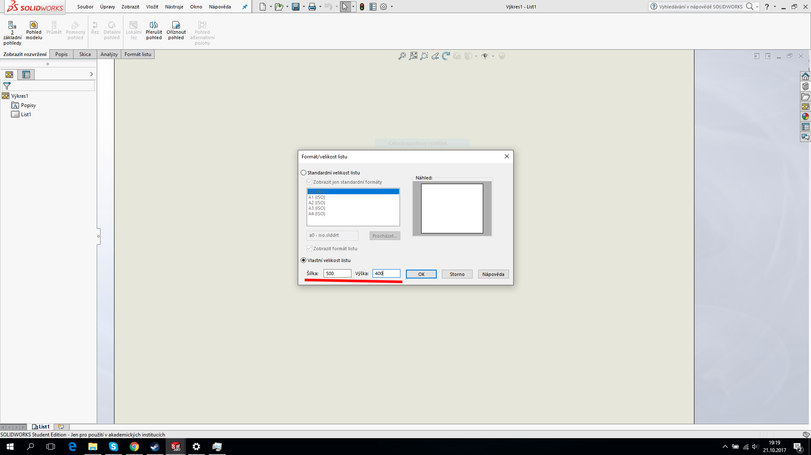
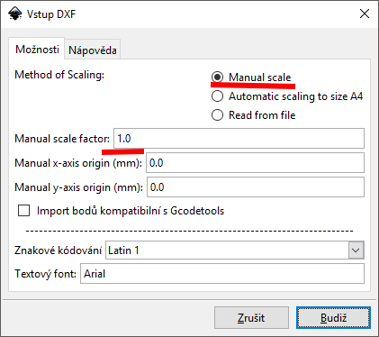
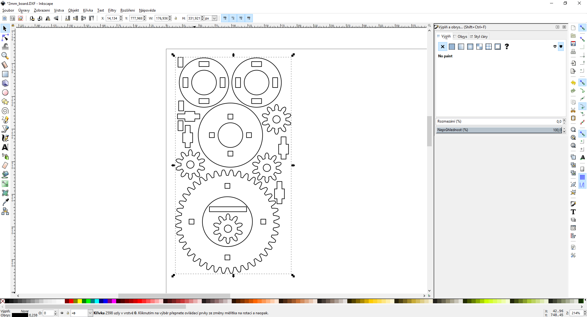
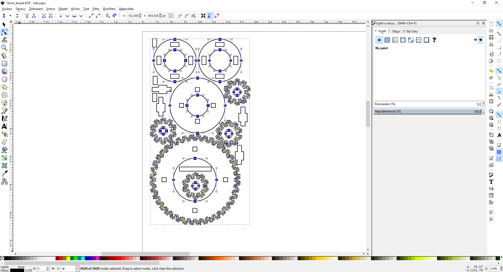
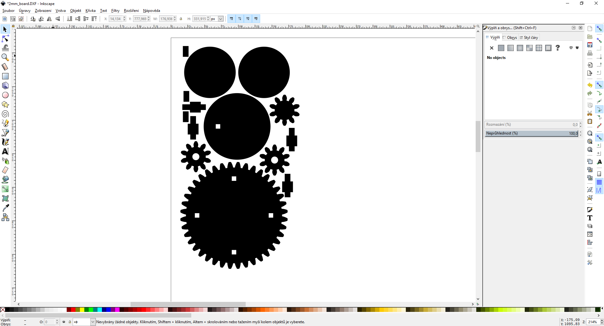
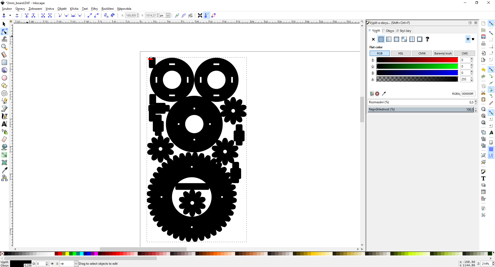
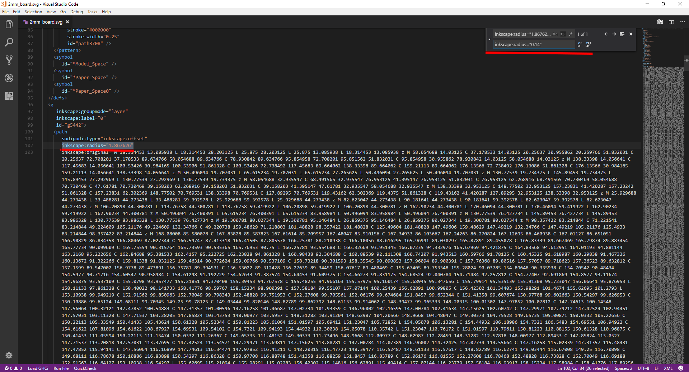

# Řezání vlastních návrhů ze SolidWorks/Fusion 360

Máš v SolidWorksu nebo ve Fusion vytvoření vlastní model určený k vyřezání na
laseru? Chceš aby tebou všechny krásně nakreslené zámečky do sebe přesně
zapadly? Zde je pro tebe návod.

Veškerý postup bude ukázán v SolidWorksu a Inkscapu, ale s drobnými obměnami by
měl jít použí i na Fusionu.

## Měření propalu laser

Abys mohl vyříznout zámečky, které do sebe skutečně pěkně a na fest zapadnou, je
třeba korigovat poloměr propalu laserového paprsku. Ten je zpravidla 0.1-0.2 mm.
Na většinu materiálů funguje korekce 0.15 mm.

Pokud ji ale chceš změřit, doporučuji si stáhnout soubor
[laserCaliber.svg](data/laserCaliber.svg) a ten na laseru vypálit. Jsou to
šablonky, na kterých je vždy pin o šírce 5mm a drážka o šířce 5 mm. V SVG je
jeich nekolik - každá s jinou korekcí (s krokem 5 setin milimetru). Jakmile máš
sadu 2x vypálenou, můžeš vyzkoušet, která dvojice s příslušnou korekcí do sebe
zapadá nejlépe. Šablonky také obsahují díru a průměru 3 mm, kterou můžeš
vyzkoušet vůči příslušné kulatině.

## Exportování modelu ze SolidWorksu

V SolidWorksu si vytvoř výkres o velikosti tvého materiálu, nastav mu měřítko
1:1 a naskládej na něj všechny díly, které chceš vyříznout. Existuje jeden dobrý
důvod, proč díly skládat do výkresu a neskládat je až v Inkscapu - pokud např.
změníš tloušťku  materiálu a zámečky se ti přeopočítají, nemusíš ručně skládat
díly znovu - aktualizace do výkresu proběhne automaticky.

Vstupní model

Nastavení rozměru výkresu

Ve vlastnostech výkresu změň měřítko na 1:1

 Při vkládání rotačních dílů, nezapomeň smazat symbol středu - jinak se vyřeže taky

Ukázka naskládaných dílů

[Ulož výkres jako DXF (a nezapomeň si uložit original!)

Jakmile máš výkres naskládaný, ulož je do formátu DXF. Při importu do Inkscapu
nezapomeň vybrat měřítko 1:1. Abys mohl aplikovat korekci propalu, je třeba dxf
ze SolidWorks "opravit". Formát DXF totiž pouze uchovává čáry a křivky, ale už
neuchovává informaci o tom, jak na sebe navazují. To zmenožňuje provést odsazení
kontur. Naštěstí je to jednoduché spravit.

Při importu do Inkscape vyber scale factor 1

Prvně vyber všechno pomocí Ctrl+A, následně stiskni Ctrl+K, což seskupí všechny
entity do jedné křivky. Poté se přepni do módu úpravy křivek (F2) a znovu
stiskni Ctrl+A - to vybere tentokrát všechny body v křivce. Následně stiskni
Shift + J, což způsobí sloučení bodů, které leží přes sebe. Nyní si provizorně
nastav výplň tvarů - měly by se korektně vyplnit díly. Pokud některé díry zmizí,
přepni mód výplně na záložce výplně. Nyní Inkscape korektně ví, co jsou tvary,
které chceš řezat a ví tedy, kterým směrem je "dovnitř" a kterým "ven".

Importovaný výkres po stisku Ctrl + A - vše vybráno

Po stisku Ctrl + K se ze všeho stane 1 křivka

Po stisku F2 se přepneš do editace křivky

Po stisku Ctrl + A vybereš všechny body a Shift + J je sloučí překrývající se

Zkušební nastavení výplně - je špatně

Opravení výplně tlačítkem vpravo

Nyní při výběru všeho stiskni Ctrl + J. To aktivuje mód dynamického odsazení.
Jak znáš z původního návodu k laseru, můžeš tažením za nově objevený bod
aplikovat korekci. Zkus to a zkontroluj, že všechny korekce se dějí, jak mají -
vnější rozměry se zvětšují, vnitřní se zmenšují. Pokud ne, v předchozím kroku se
stala chyba. Nyní dokument ulož jako SVG a otevři jej ve svém oblíbeném textovém
editoru - WordPad ani Word není textový editor. Vhodnými programy jsou např.
Poznámkový blok, PSPad, VS Code, Atom nebo VIM. Nyní najdi výskyt všech položek
"inkscape:radius=0.000" - to je hodnota korekce propalu - a nahraď ji za tebou
požadovou korekci v milimetrech - tedy např. "inkscape:radisu=0.15". Když
dokument uložíš a znovu otevřeš v Inkscapu, korekce správné velikosti bude
aplikována.

Po stisku Ctrl + J a tažením jsme ověřili správnost směru korekcí

Nastavíme červenou tenkou čáru

Otevřeme uložené SVG v textovém editoru

Provedme nahrazení řetězce pro korekci propalu

Znovu otevřený dokument v Inkscape se správnými korekcemi

A nyní hurá pálit!
