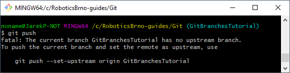
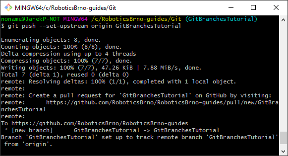

# Git aneb jak na něj

## Práce s branchemi a pull-requesty aneb
## Přidávání commitů do repozitářů se zakázaným `pushem` do `master` branche

Některé repozitáře mají zakázáno přímé přidávání commitů do `master` větve:   
- ArduinoLearningKitStarter
- ArduinoLearningKitStarter-library
- RB3201-RBControl
- RB3201-RBControl-library

U nich je potřeba provést následující postup v command line:
1. otevřít si Gitovou command line -> ve Windows kliknout pravím tlačítkem myši v adresáři s repozitářem a vybrat z nabídky `Git Bash Here` (automatický vždy nainstalováno s Gitem)
1. vytvořit si novou [větev/branch](https://www.atlassian.com/git/tutorials/using-branches) pomocí příkazu `git checkout -b JMENO-VASI-NOVE-BRACHE`; jméno zvolte tak, aby trochu vystihovalo o jakou změnu se jedná (bez mezer, lze použít pomlčky/podtržítka a malá/velká písmena)
1. nyní máte vytvořenou novou větev s názvem např. `JMENO-VASI-NOVE-BRACHE`
1. teď je potřeba přidat změny do dané branche, vytvořit tedy nový commit, ať už vašim oblíbeným způsobem (TortoiseGit, VS Code...) nebo pomocí command line `git add CESTA-K-VASIM-SOUBORUM.txt`, `git commit -m "TEXT VASEHO COMMITU"`
1. jakmile máte přidány změny/commity v repozitáři, *pushnete* danou větev/branch na server pomocí příkazu v command line `git push`
1. pravděpodobně vám vyskočí následující chyba: `fatal: The current branch JMENO-VASI-NOVE-BRACHE has no upstream branch. To push the current branch and set the remote as upstream, use git push --set-upstream origin JMENO-VASI-NOVE-BRACHE`, je potřeba zavolat tento příkaz `git push --set-upstream origin JMENO-VASI-NOVE-BRACHE`, po jeho provedení byste na Gitovém serveru měli vidět vaši novou branch: `https://github.com/VAS-USERNAME/JMENO-REPOZITARE/commits/JMENO-VASI-NOVE-BRACHE`
1. nyní lze na GitHubu vytvořit [`pull-request`](https://help.github.com/en/articles/about-pull-requests) ("žádost" o přidání změn do jiné větve/branche) a tímto krokem můžeme dostat dané změnu do `master` větve;   
správce daného repozitáře časem vaše změny zkontroluje a buď vám napíše požadavky na změny a nebo dané změny příjme (`mergne`)
1. pokud budete požádáni o nějaké změny, stačí u sebe provést dané změny, přidat přes commit do stejné branche (`git add ...; git commit ...`) a odeslat na Gitový server (`git push`) 

### Názorná ukázka

#### 1. otevřít si Gitovou command line 


#### 2. vytvoř novou branch

```
git checkout -b GitBranchesTutorial
```


#### 3. máte vytvořenou novou branch


#### 4. vytvořte commit se změnami

```
git add Git.md
git add *.png
git commit -m "Git: add tutorial for working with branches"
```

Přidání souborů do commitu:


*Poznámka:* `git status` zobrazí stav všech souborů v repozitáři

Vytvoření commitu:


Přes příkaz `git log` si lze zobrazit seznam commitů:


#### 5. odešlete změny na Gitový server

```
git push
```


#### 6. chybová hláška při `git push`

Pokud dostanete následující error

```
noname@JarekP-NOT MINGW64 /c/RoboticsBrno-guides/Git (GitBranchesTutorial)
$ git push
fatal: The current branch GitBranchesTutorial has no upstream branch.
To push the current branch and set the remote as upstream, use

    git push --set-upstream origin GitBranchesTutorial
```



je potřeba zkopírovat daný příkaz a zavolat jej v command line:

```
git push --set-upstream origin GitBranchesTutorial
```



Nyní by již měla být daná branch nahrána na Gitovém serveru:   
`https://github.com/VAS-USERNAME/JMENO-REPOZITARE/commits/JMENO-VASI-NOVE-BRACHE`

[https://github.com/RoboticsBrno/RoboticsBrno-guides/commits/GitBranchesTutorial](https://github.com/RoboticsBrno/RoboticsBrno-guides/commits/GitBranchesTutorial)


#### 7. vytvoření pull-requestu do `master` větve

Pomocí tlačítka `Compare & pull request` začnete vytvářet `pull-request`:


Při vytváření `pull-requestu` můžete:
- přidávat podrobnější popis
- určovat osoby, které mají daný `pull-request` zkontrolovat (`Reviewers`)
- označovat jakého je typu (`Labels` - bug, improvement...)
- ...


Po vytvoření `pull-requestu` vám jej mohou ostatní komentovat, připomínkovat, opravovat a následně přijmout (`Merge`) nebo zamítnou (`Close`).


Kdykoliv můžete do `pull-requestu` přidávat další commity. Stačí u sebe provést dané změny, přidat přes commit do stejné branche (`git add ...; git commit ...`) a odeslat na Gitový server (`git push`) 