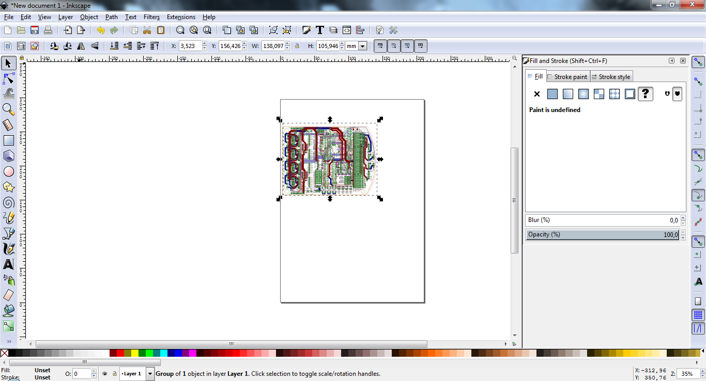
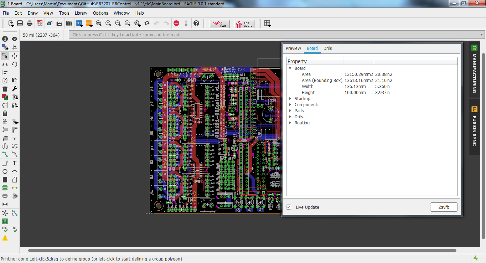
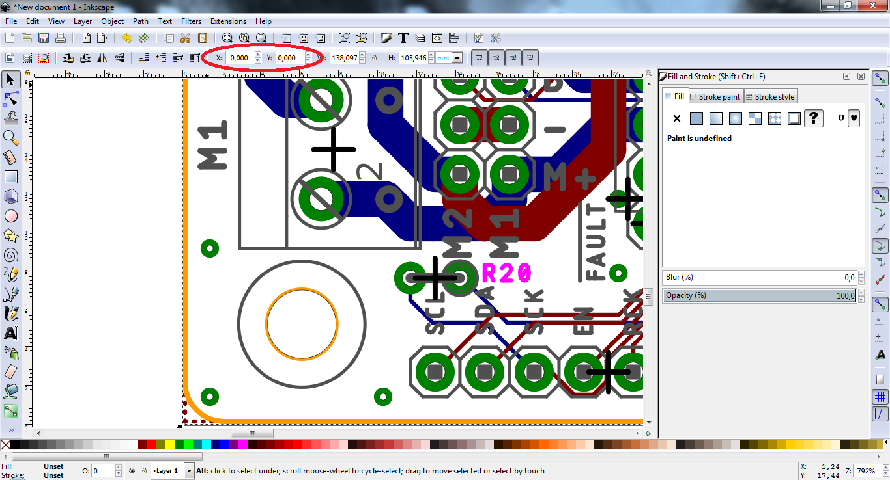
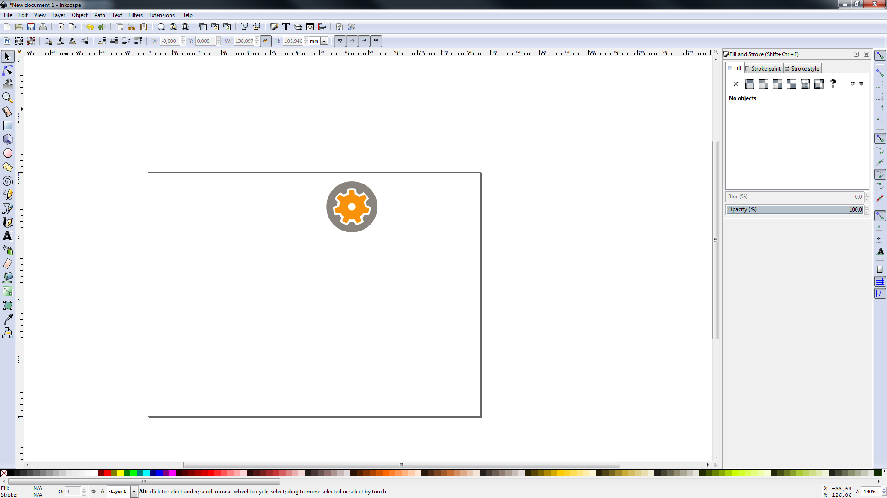
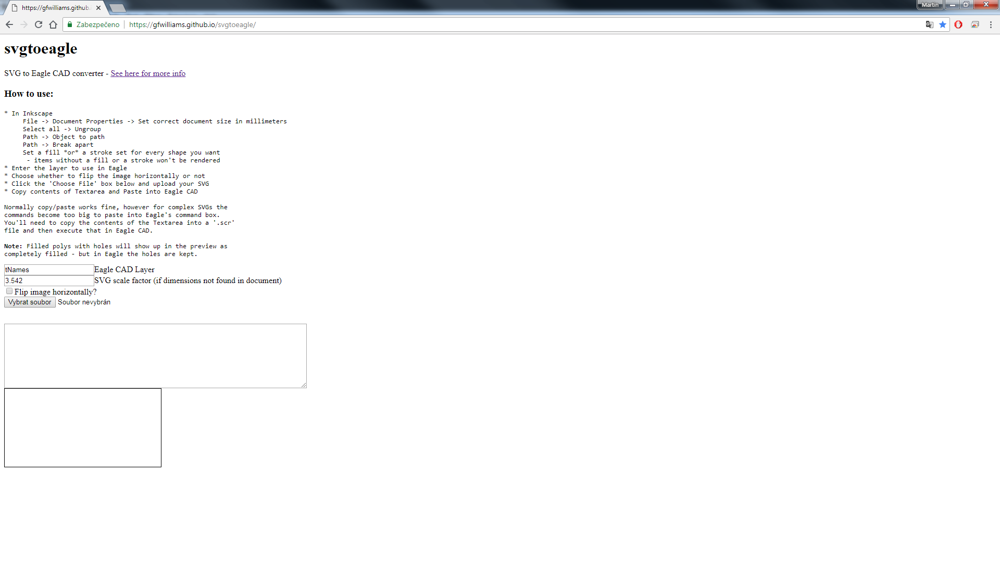
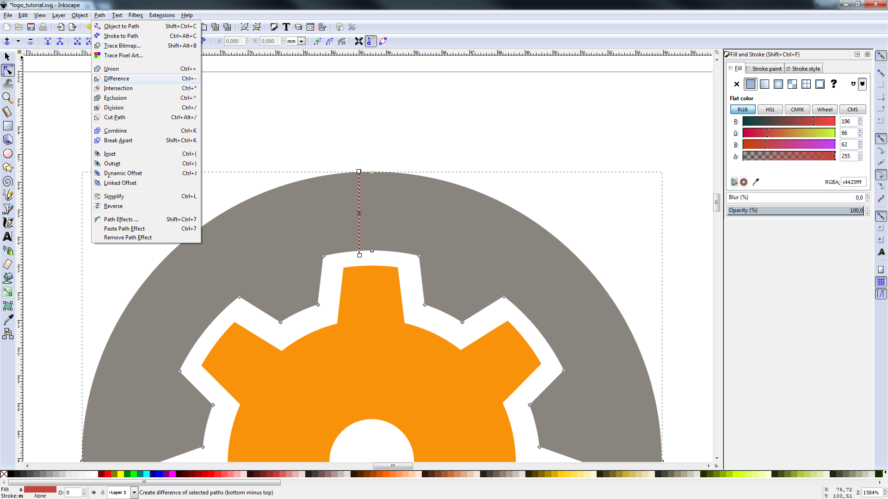

# Jak importovat loga do desky v Eagle

## Instalace software
Je třeba stáhnout a nainstalovat program [Inkscape](https://inkscape.org/cs/).

Dále samozřejmě program [Eagle](https://www.autodesk.com/products/eagle/overview) - návod je dělán ve verzi 9.0.1.

## Příprava dat
Loga, která chceme importovat, je třeba mít převedeny do formátu SVG.
Dále doporučuji, ale není to nutné, vyexportovat si z Eaglu náhled desky. Bude se nám potom lépe umisťovat logo, např. nám potom nehrozí umístění loga na součástky.

### Export desky z Eagle a import do Inkscape
Pro export dáme `File` -> `Print (Ctrl+P)` a otevře se nám okno, kde musíme nastavit následující parametry:

Poté importujeme vzniklé PDF do Inkscape, kde jsme si vytvořili nový dokument, `File` -> `Import Ctrl+I` a vybereme soubor PDF, odklikáme všechny dialogy a počkáme než se PDF převede do Inkscapu.

Výsledek by měl vypadat takto:

## Úprava dokumentu a import loga

Abychom mohli nastavit správnou velikost dokumentu, musíme zjistit rozměry DPS. Rozměry zjistíme tak, že si otevřeme DPS v Eagle a vpravo klikneme na `MANAFACTURING` -> `Board` a rozklikneme roletku `Board`. Zde nás zajímají parametry Width (šířka) a Height (výška).

Potřebujeme upravit velikost dokumentu, abychom měli vzor DPS a loga 1:1. Otevřeme vlastnosti dokumentu `File` -> `Document Properties (Shift+Ctrl+D)`. Zde zhruba uprostřed najdeme nastavení `Custom size`. V `Custom size` nastavíme hodnoty, které jsme získali v předchozím kroku:

Jakmile máme nastavenou stejnou velikost dokumentu, jako je velikost DPS, musíme DPS posunout tak, aby její okraje splývaly s okraji dokumentu. To provedeme tak, že vybereme DPS a nastavíme její pozici v souřadnicovém systému na `X = 0`,  `Y = 0`:

Nyní máme správně nastaven dokument, importovanou DPS jako předlohu a můžeme přistoupit k vložení samotných log.

Logo vložíme kliknutím na `File` -> `Import (Ctrl+I)` a vybereme SVG soubor s logem. Jakmile máme vloženo, je třeba nastavit vhodnou velikost loga a jeho umístění.

Po vhodném umístění logo je potřeba odstranit DPS, kterou jsme použili jako šablonu.

Následně si výsledný dokument uložte s příponou `.svg`.

## Převod loga do scriptu pro Eagle

Logo budeme vkládat jako script do Eaglu, který nám vytvoří body a následně polygony, které budou tvořit výsledné obrazce. Pro generování scriptu použijeme [tuhle](https://gfwilliams.github.io/svgtoeagle/) stránku:

Zde je potřeba vyplnit pole `Eagle CAD Layer`, do tohoto pole zadejte název vrstvy v Eagle, do které chcete výsledná loga vložit. Běžně se používají vrstvy `tDocu` (číslo 51) a `bDocu` (číslo 52), kterou budeme používat v tomto návodě.

Dále je třeba nastavit `SVG scale factor` na hodnotu `1`, ale je možné použít i jiné hodnoty, záleží na tom jaké jste si nastavili měřítko dokumentu v Inkscape, já měl 1:1 tudíž volím 1.

Je možné zde výsledný obrazec ozrcadlit, ale nedoporučuji to, protože dojde ke změně pozic log. Mnohem lepší je loga ozrcadlit přímo v Inkscapu (hlavně v případě více log v jednom dokumentu). Ozrcadlení je potřeba provést v případě, kdy chcete loga vkládat na spodní stranu desky (`bDocu`,`bXY`).

No a nakonec vybereme soubor SVG (`.svg`), ve kterém máme náš dokument, který má nastaveny správné rozměry a obsahuje pouze logo.

Takhle může vypadat výsledek:

Vidíme ale, že je barevně vyplněna i původně bílá plocha uprostřed loga, kterou by Eagle bral jako součást loga a tudíž by z celého loga byl vidět jen kruh.

Musíme tedy opravit uzavřené obrysy, které mají obsahovat nějakou "díru". Tohoto lze nejjednodušeji dosáhnout tak, že si v Inkscapu vytvoříme miniaturní obdélník, který nám vytvoří "průtok" do díry v uzavřeném obrysu:

Jakmile máme vytvořeno, zvolíme nástroj `Edit paths by nodes (F2)` a vybereme obrys, do kterého má být udělána díra a námi vytvořený obdélník (v tomto případě červený) a zvolíme nástroj `Path` -> `Difference (Ctrl+-)`, tento postup samozřejmě opakujeme pro všechny uzavřené obrysy obsahující díru, které se zde vyskytují:

Nyní máme v obrysu vytvořen malý "průtok", díky kterému už se nám vytvoří korektní data pro Eagle:

Zkontrolujeme na náhledu, že se nám všechny loga korektně převedly. Jestli je všechno v pořádku, tak zkopírujeme vygenerovaný text v poli nad náhledem např. do poznámkového bloku (já používám [PSPad](http://www.pspad.com/cz/)) a uložte jej jako soubor s koncovkou `.scr`.

Nyní výsledný soubor importujeme do Eagle `File` -> `Execute Script...`, otevře se nám následující okno:

Zde vybereme náš soubor `.scr` a potvrdíme výběr. Nyní již máme naše logo v Eaglu ve vrstvě číslem 52 s názvem `bDocu` jako polygon a není problém jej při výrobě natisknout na DPS jako popisek. Správnost si lze ověřit tak, že si DPS zkusím v Eaglu vytisknout do PDF.

