# Návod na slepení autíčka
## Příprava
Na slepení autíčka budeme potřebovat:
* 2 bočnice
* 9 menších kousků dřeva
* 4 kolečka
* 4 hřebíčky

Dále si připravíme lepidlo a smirkový papír. Celý proces provádíme na podložce, aby nedošlo k poškození stolu.

## Lepení základních dílků
### Zadní část
Nejdříve si slepíme zadní část autíčka. Ta bude mít finální tvar písmene Z. 
1. Slepíme k sobě dvě malá dřívka tak, aby výsledek měl tvar písmene L. Dřívka MUSÍ svírat pravý úhel!

2. Necháme lepidlo zaschnout
3. Na dřívko, které je na delší straně L-tvaru přilepíme ještě jedno, vznikne tedy tvar podobný písmenu Z

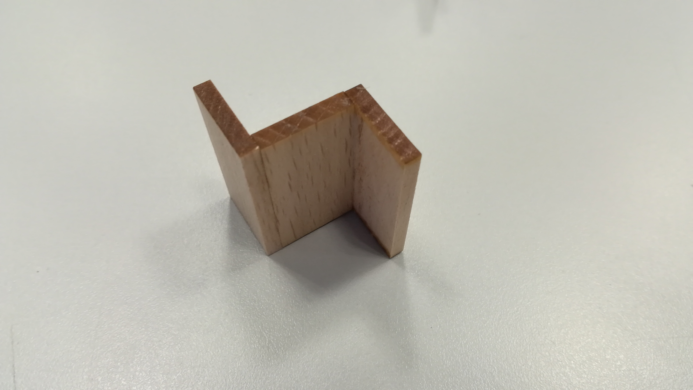

### Přední část
Na slepení přední části autíčka budeme potřebovat 4 malá dřívka.

1. Vezmeme si dvě bočnice, které si dáme rovnoběžně vedle sebe. Mezi ně vložíme dvě dřívka, která slepíme úzkými stranami k sobě. Bočnice k dřívkům přitlačíme, aby se srovnala.

2. Na tento útvar přilepíme ještě jedno dřívko, které bude k těmto dvěma kolmé. 

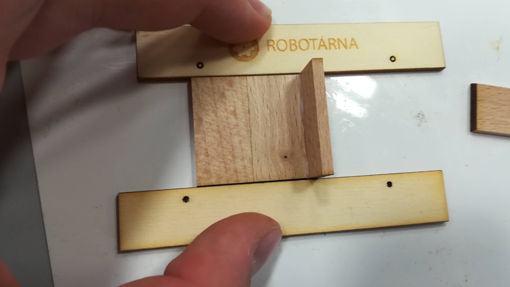

3. Aby byl tento tvar pevný, je třeba ze strany, kde je vertikálně umístěné dřívko přiložit ještě dřívko jiné (nelepit), které použijeme ke stlačení útvaru k sobě.

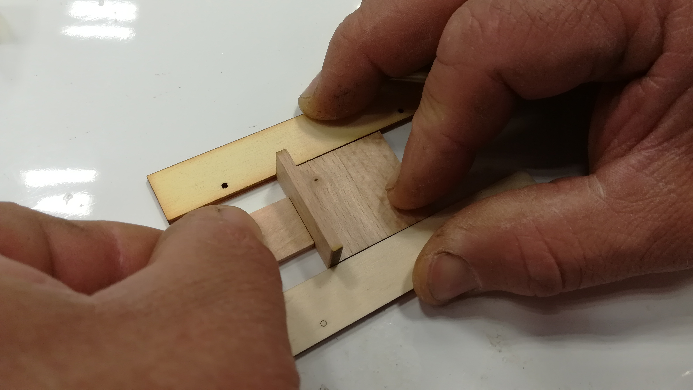

4. Nakonec bočnice odděláme, aby se neslepily a útvar po podložce opatrně posuneme, aby se nám k ní nepřilepil. Lepidlo necháme zaschnout.

Máme tedy slepeny tyto dva dílky:

### Sedačka pro řidiče
Nyní se vrhneme na slepení sedačky. K tomu budeme potřebovat dvě dřívka.

1. Jedno z dřívek je třeba zkosit. To provedeme zbroušením jedné jeho delší hrany smirkovým papírem.

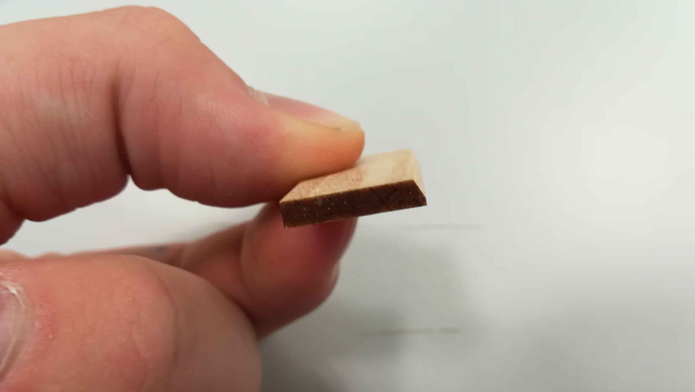

2. Tento zbroušený dílek přilepíme zkosenou hranou na delší stranu dřívka druhého, viz obrázek:

Výsledný tvar vypadá shora takto:

### Přilepení čelního skla
1. Vyrobíme si ještě jeden zkosený kousek dřevíčka.
2. Ten následně přilepíme k přední části autíčka, viz obrázek:

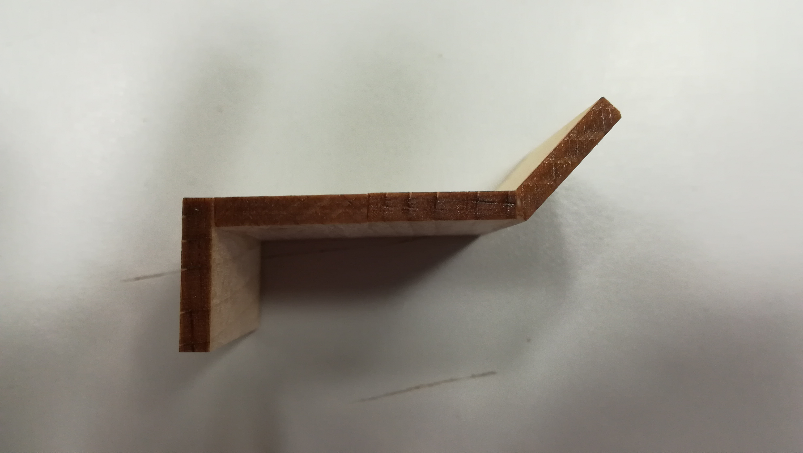

Poznámka: Čelní sklo je možné vlepit i po slepení celého autíčka, záleží na každém, jak su mu to bude dělat lépe.

## Slepení autíčka
1. Na stůl si položíme jednu z bočnic tak, že bude směřovat logem směrem do stolu a dírky na kolečka budou směřovat DOLŮ.
2. Dílky auta si k ní naskládáme tak, jak budou následně vlepeny do autíčka:

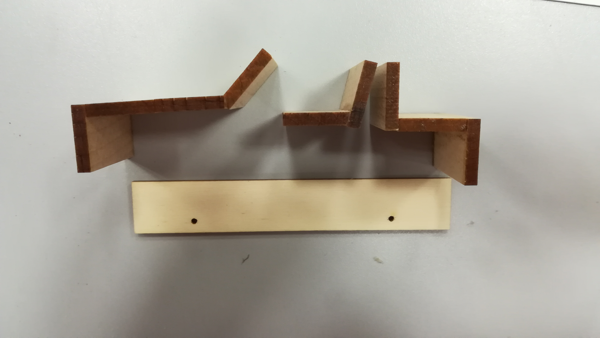

3. Začneme dílky lepit na bočnici v pořadí: přední část; zadní část; sedačka, popřípadě nakonec i čelní sklo, pokud jej ještě nemáme přilepené.

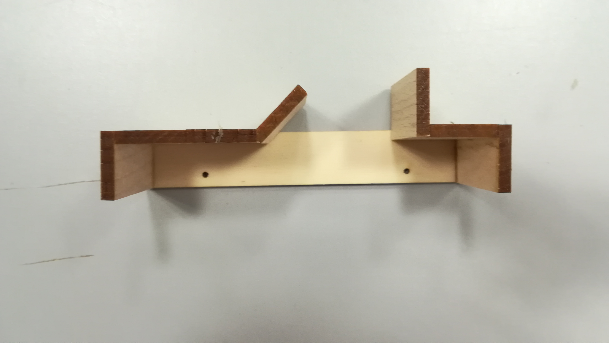

4. Nakonec nahoru přilepíme druhou bočnici tak, že logo bude směřovat k nám a dírky na kolečna opět DOLŮ.

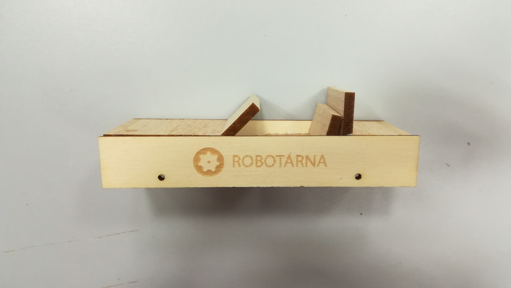

5. Celé autíčko zafixujeme pomocí svěrek, dokud nám lepidlo nezaschne.

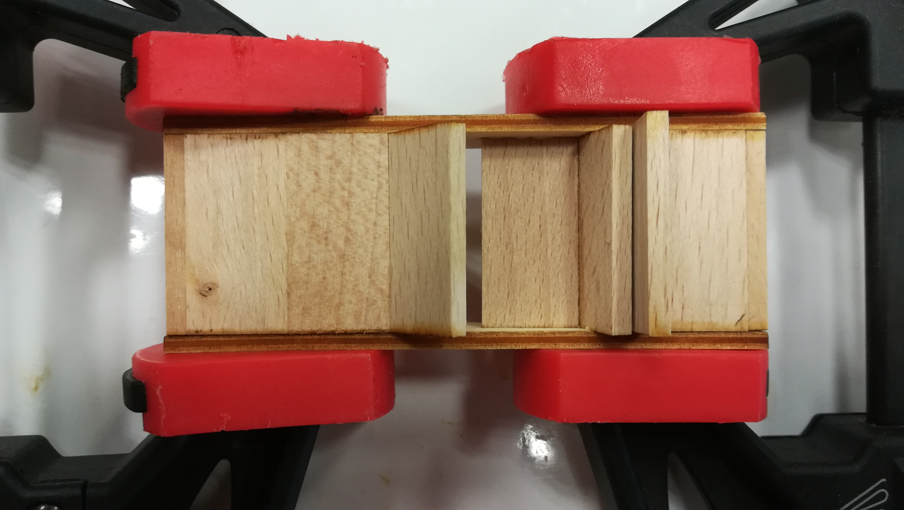

## Přidání koleček
Jakmile nám zaschnulo lepidlo, jsme připraveni přidat k autíčku kolečka. 
1. Nejdříve z dírek odstraníme hřebíčkem zbytek dřeva, jak u koleček, tak i u "karoserie" auta.

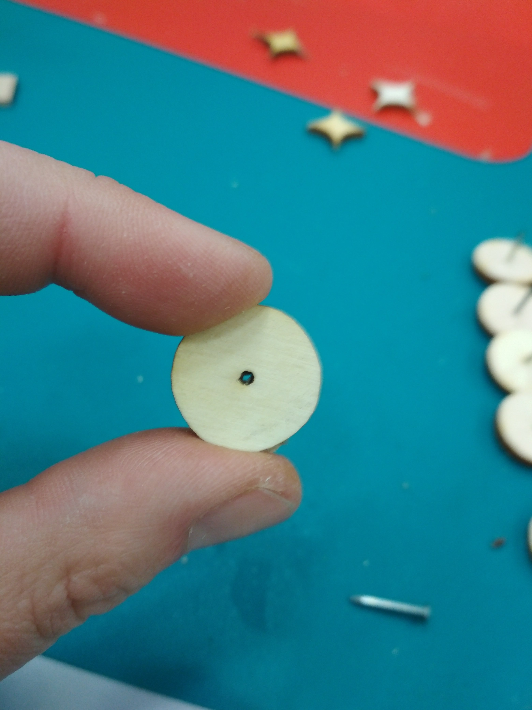

2. Hřebíček zatlačíme do dírky kolečka.

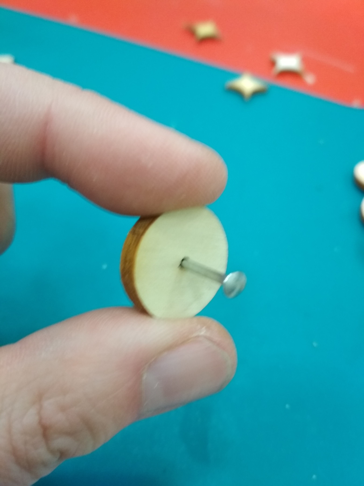
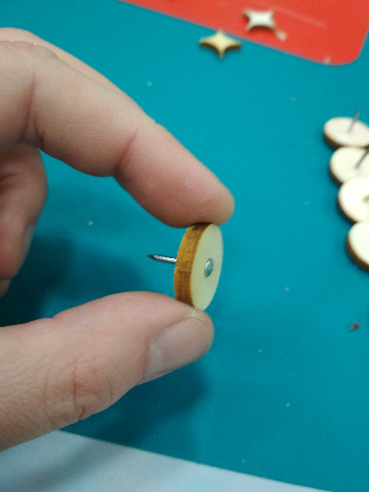

3. Nakonec zatlačíme hřebíček, na kterém je kolečko do dírky v bočnici na autíčku.

# Finální výrobek

