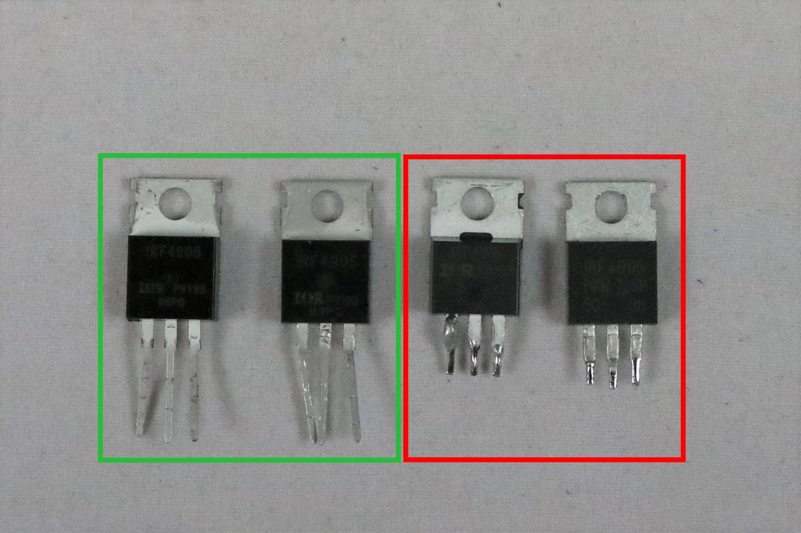

# Součástky

## Unipolární tranzistor IRF4905

Při osazování unipolárních tranzistorů IRF4905 ([datasheet](https://www.infineon.com/dgdl/irf4905pbf.pdf?fileId=5546d462533600a4015355e329b1197e)) na desku RB3201-RBControl (kde jsou použity jako ochrana proti přepólování a zapínání/vypínání desky) byl zaznamenán problém s některými sériemi těchto tranzistorů.

Všechny testované tranzistory zakoupené v Číně přes portál Alibaba neodpovídaly specifikaci v datasheetu.
Jejich vnitřní odpor byl mnohem vyšší než udává specifikace (specifikace udává maximálně 20 mΩ).
Část tranzistorů měla přibližně 3krát větší vnitřní odpor (což je pro potřeby RBControlu stále použitelná hodnota), ale některé měly vnitřní odpor přibližně 40krát větší.

### Testované série IRF4905

- P638J - zakoupeny v ČR - odpor odpovídá specifikaci 20 mΩ
- P619D, P719D - odpor cca. 60 mΩ - stále použitelné (zelený obdélník ve fotce)
- 725P, P816J - odpor cca. 800 mΩ - nepoužitelné (červený obdélník ve fotce)
